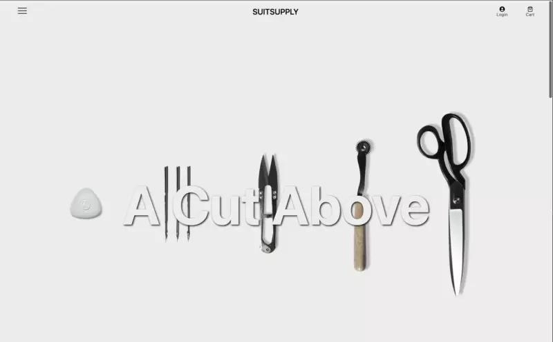

 

  

<h3 align="center">E-Commerce Site Utilizing Headless CMS</h3>
     
   

    This project is a fully functional e-commerce site utilizing product images from my favorite retailer. :bowtie: The site is built with the React-based framework Next.js. It features multiple product categories contained within a sidebar navigation, individual product pages, a functional shopping cart, as well as checkout for both guests and logged in users with integrated authentication.  
     
     
    <a href="https://github.com/dinardavis/suitsupply"><strong>Explore the docs »</strong></a>
     
     
    <a href="https://dinardavis.github.io/suitsupply/">View Demo</a>
    ·
    <a href="https://github.com/dinardavis/suitsupply/issues">Report Bug</a>
    ·
    <a href="https://github.com/dinardavis/suitsupply/issues">Request Feature</a>
  

<!-- TABLE OF CONTENTS -->

  
Table of Contents

  <ol>
    <li>
      <a href="#about-the-project">About The Project</a>
      <ul>
        <li><a href="#built-with">Built With</a></li>
      </ul>
    </li>
    <li><a href="#usage">Usage</a></li>
    <li><a href="#contact">Contact</a></li>
  </ol>

<!-- ABOUT THE PROJECT -->
## About The Project

 

  

 

(<a href="#top">back to top</a>)

### Built With

* 
* 
* 
*  
*  
* 
* 
* Additionally: Cloudinary & Auth0

(<a href="#top">back to top</a>)

<!-- USAGE EXAMPLES -->
## Usage

As mentioned, the application is fully functional. Click here to view the [Live Demo](https://suitsupply.vercel.app/). Users are able to create new credentials, or login using an existing Google account. However, the checkout is also able to be processed without logging in. To proceed with the development/test mode checkout please add properly formatted email and shipping information. For payment details you may enter the following: 

Card Number: 4242 4242 4242 4242
Exp Date: 04/24
CVC: 424

<!-- CONTACT -->
## Contact

 
  

Project Link: [https://github.com/dinardavis/spacex_clone](https://github.com/dinardavis/travel_app)

(<a href="#top">back to top</a>)

